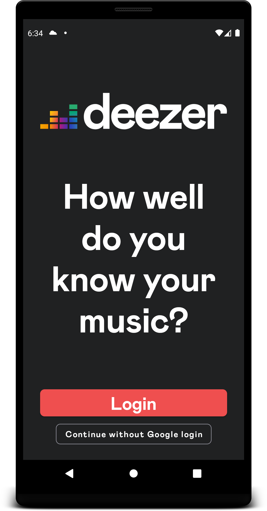
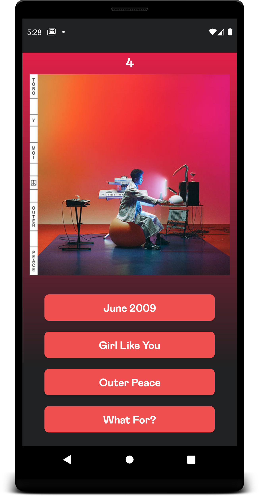
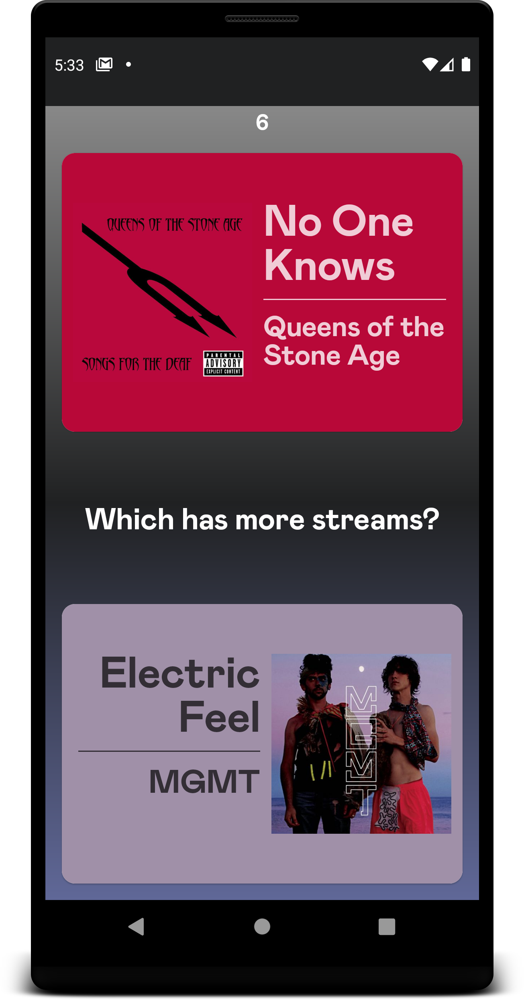
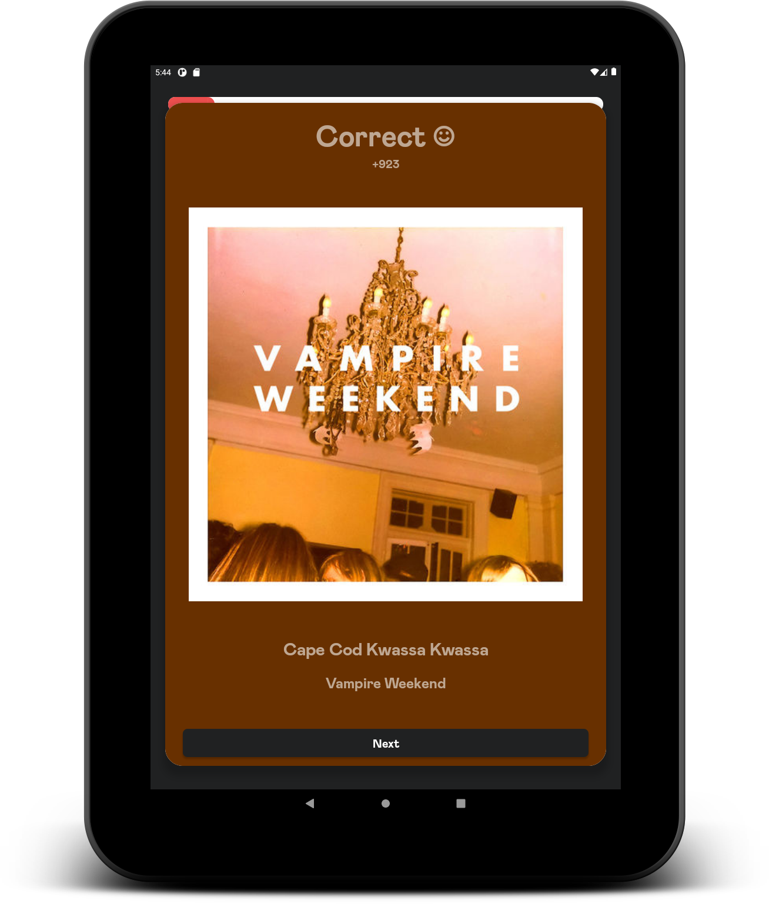
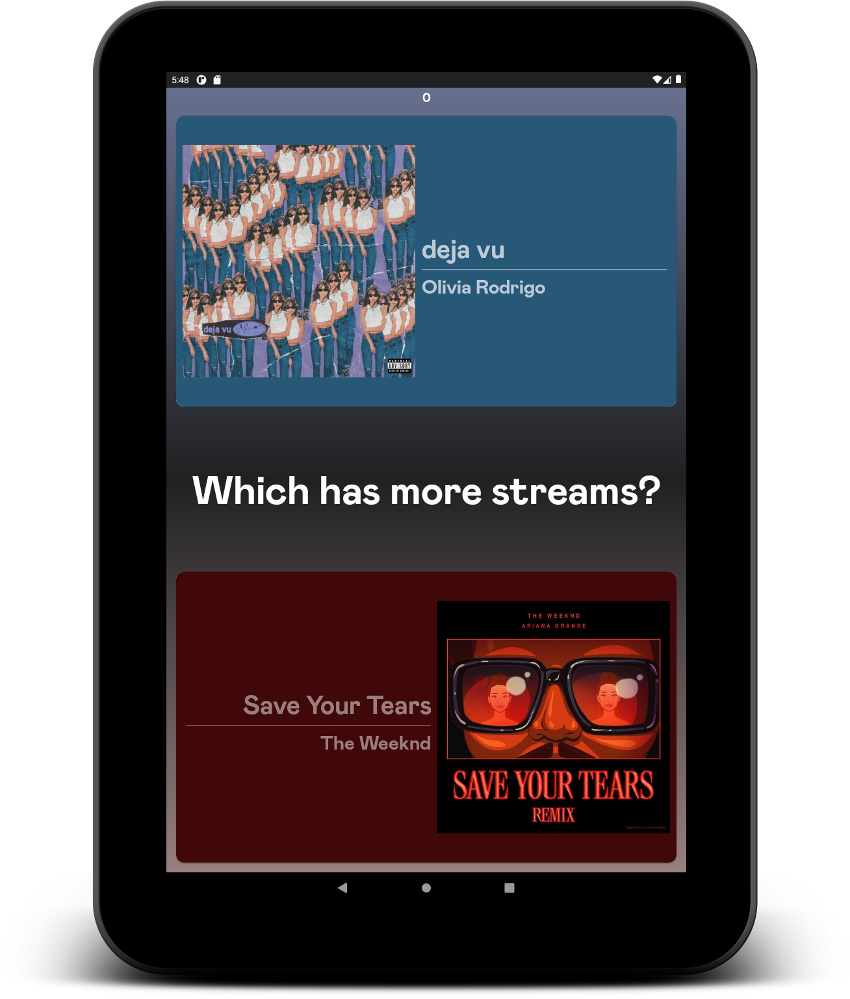

# Deezer Game
Collection of games using Spotify and LastFM's APIs to test your knowledge on top Spotify playlists and your own Spotify library.

[Play Store link](https://play.google.com/store/apps/details?id=com.tom.spotifygamev3)

N.B. As I finished this app I realised you had to apply to Spotify to increase the user base from a max of 25 people. While going through that process they pointed me to their Developer Policy which said, under 'Some prohibited applications', 'Do not create a game'. Definitely on me for not checking beforehand but if you want to try out the app just email me at bobtom8428gm@gmail.com with your Spotify account login email and I'll add you to be one of the lucky 25. Thanks

## Screenshots
### Phone

  
  
  

### Tablet

  
  

## Technologies
* Android + Kotlin
* First app trying out MVVM architecture
* Retrofit - HTTP API calls
* Room - Local database for caching
* [Spotify API](https://developer.spotify.com/discover/) and [LastFM Api](https://www.last.fm/api)
  * Last FM was used due to Spotify not providing the number of streams a track has in its API which was weird.
* Google Play Services - Leaderboards and app hosting
