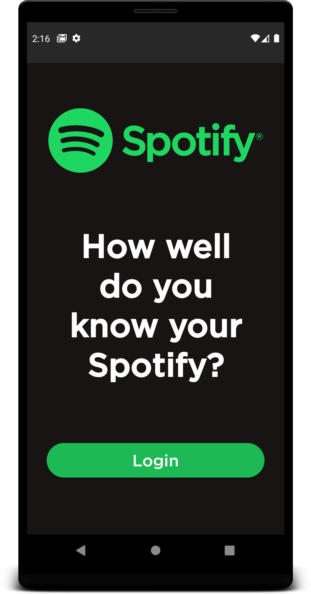
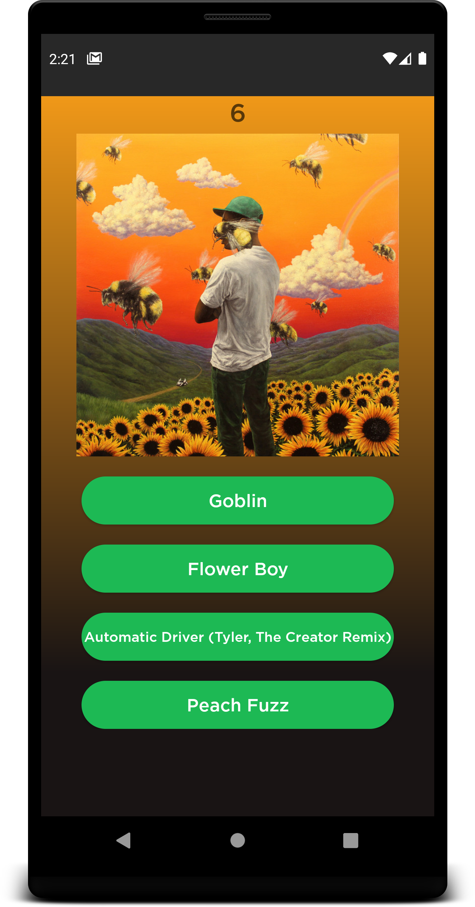
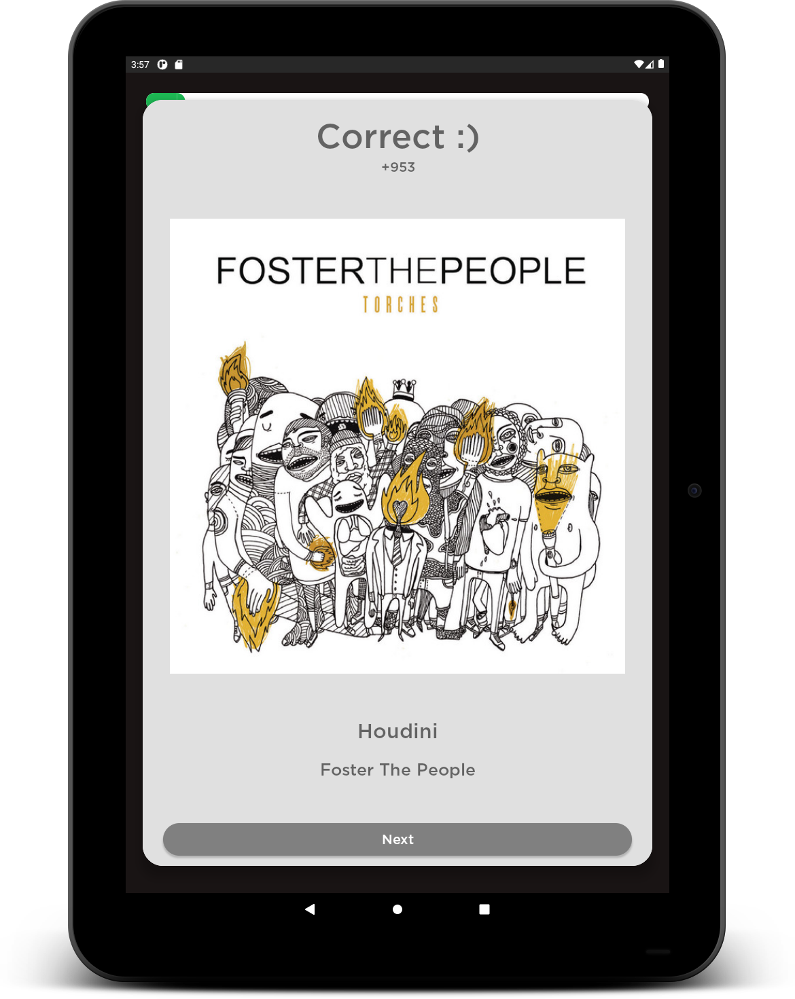

# Testify - for Spotify
Collection of games using Spotify and LastFM's APIs to test your knowledge on top Spotify playlists and your own Spotify library.

## Screenshots
### Phone

  
  
  

### Tablet

  
  

## Technologies
* Android + Kotlin
* First app trying out MVVM architecture
* Retrofit - HTTP API calls
* Room - Local database for caching
* [Spotify API](https://developer.spotify.com/discover/) and [LastFM Api](https://www.last.fm/api)
  * Last FM was used due to Spotify not providing the number of streams a track has in its API which was weird.
* Google Play Services - Leaderboards and app hosting
